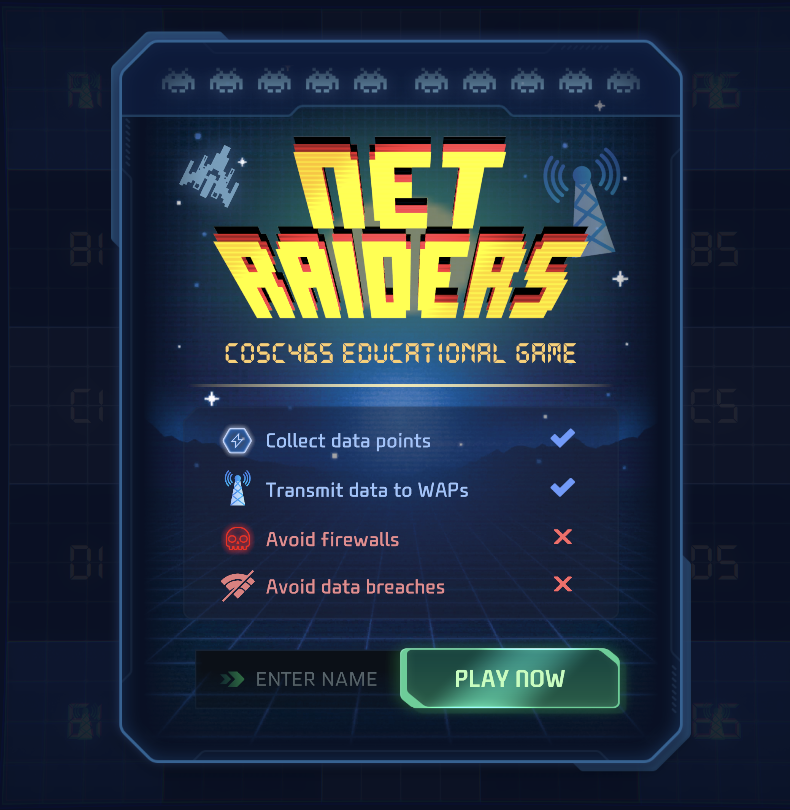
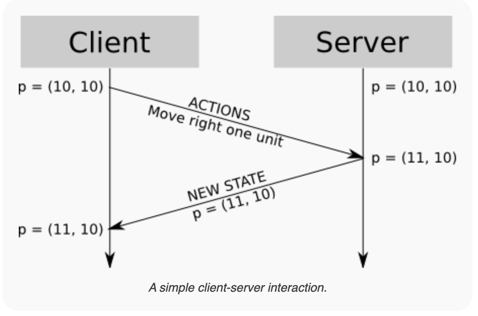
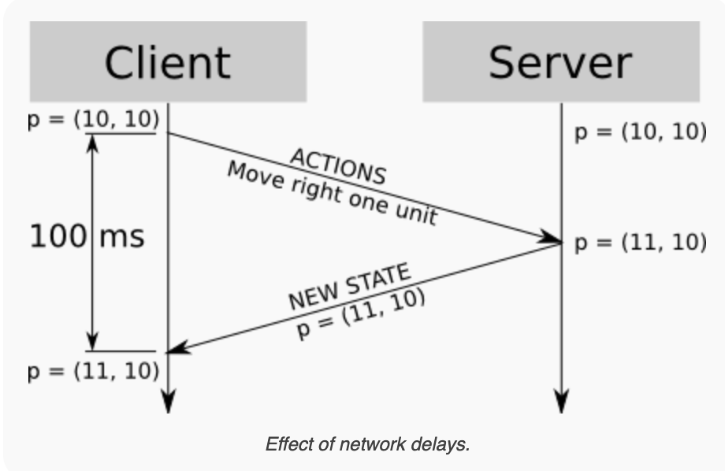
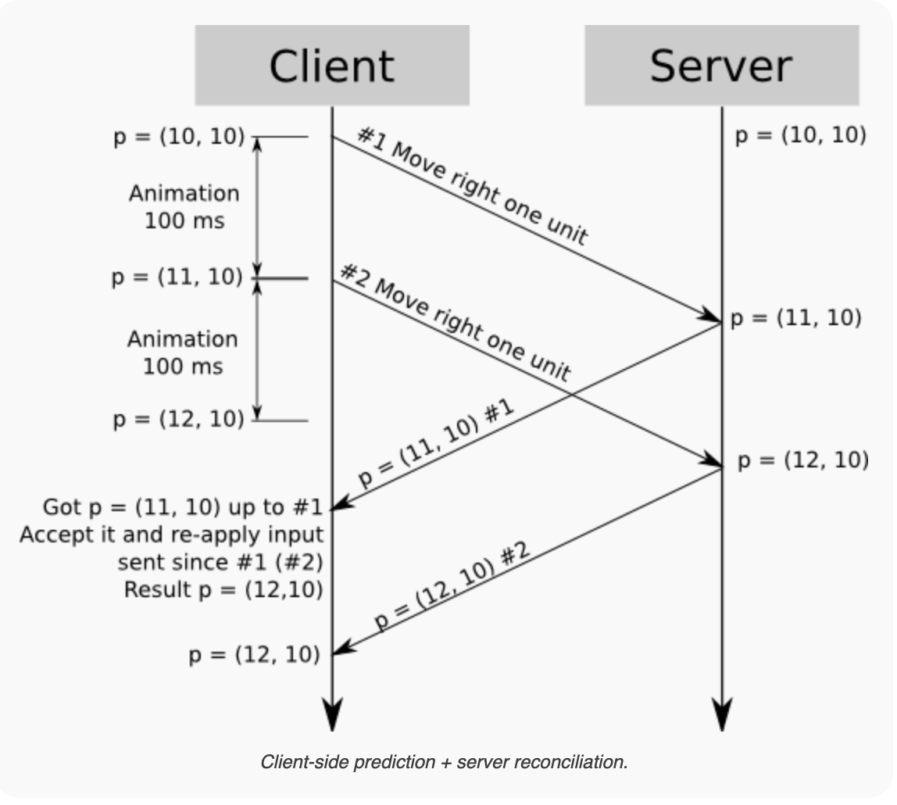
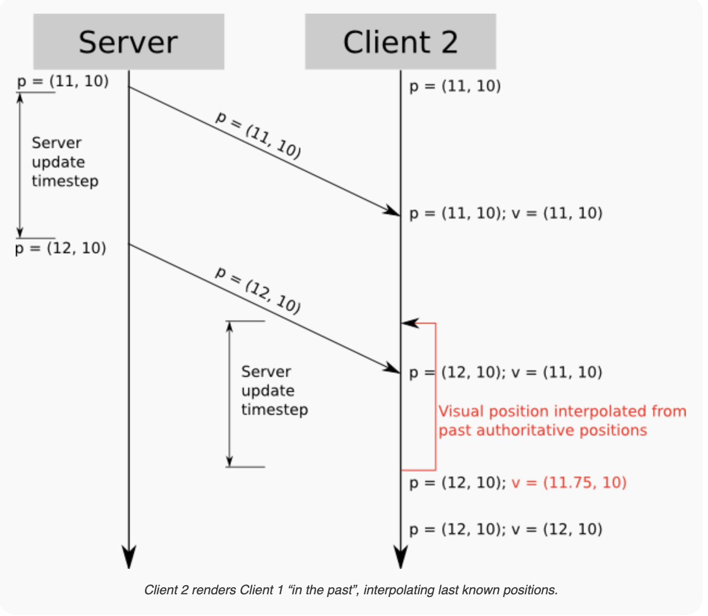

# Netraiders
## Final Artifacts
## 👾 PLAY NOW 👾 -> https://spock.cs.colgate.edu

Netraiders is designed to be an **educational tool** for Computer Networks (COSC465) students. 

All code, as well as this readme, are designed so that future students can easily replicate making a multiplayer game network simulation. 
Netraiders uses a client / server model, where the server is the authoritative state on knowledge. This makes it difficult for any malicious player to cheat.

  

### KEY TERMS
- **Network Update Loop** refers to the while True loop running in the '/netraider' websocket, which can be found in the [`api.py`](webserver/api.py#L50-L90). This is where all important player state information, such as position, scale, or score, are computed and stored. 
- **Unity Update Loop** refers to the main Unity Engine loop. This is where all visual rendering is done.

### ARCHITECTURE
- **Authoritative Simulation** is the type of multiplayer architecture in netraiders. Players simply send their keyboard and mouse inputs to the server, and the server processes the clients new state. This is done 20 times a second. This means that it is impossible for players to commit the most egregious of hacks like getting an unlimited score.
- **Tick Based Simulation** is a way of simulating a game over a network. If implemented properly, it allows for consistent time across all clients. Each game 'tick' in a tick based simulation represents a discrete update cycle where user inputs from the previous tick are processed. Our Python implementation of our Netraider simulation can be found in [`netraidersimulation.py`](webserver/netraidersimulation.py)

### CHALLENGE OF LOW-FREQUENCY UPDATES
With a server running at a limited number of ticks per second, the amount of updates a player experiences can be jittery. In a third of a second, a plane moves at over 250 feet per second. Comparing this to game visualization and interaction mechanics, a lot can happen in just a fraction of a second. It is often not feasible to have a tick rate so fast that the game can run due to the limations of networks. A frame(tick) rate of 120 or 60 can cause a massive amount of lag as the server attempts to process all this data. To ensure that players don't experience jittery gameplay with a smaller tickrate, three techniques have been implemented into NetRaiders, as is standard in many online games. 

Image credit: [Gabriel Gambetta](https://www.gabrielgambetta.com)

### SMOOTH LOCAL CLIENT VISUALS
- **Client Side Prediction** allows for smooth gameplay for the *local player*. The Unity Update loop can run at a few hundred frames a second. The Network Update Loop runs at a strict 20 frames (ticks) per second, because networks just can't transmit data that fast (especially over TCP/IP).

  
 Image credit: [Gabriel Gambetta](https://www.gabrielgambetta.com)

- **Server Reconcilliation:** sometimes, the server takes a long time to respond to a client. But because we implemetned client side prediction, our character is still smoothly moving along the screen even though the server hasn't told us of our newest authoritative state! When the server eventually responds, our client will be so far away from the state the server sent, and thus when their position is corrected, they will get snapped back in time to an older position. This makes for choppy and jittery visuals. To account for this, clients cache their "in flight' inputs. In flight inputs are inputs which the client has sent to the server, but the server has not yet sent back the players new state. Then, when the server sends us an older, out of date, authoritative state, we correct ourselves to that position, and reapply all inputs that are in flight. If the client was lying about their position, it will be corrected. If the client is telling the truth about their inputs, their prediction should be 1:1 identical to the servers call. 

  
 Image credit: [Gabriel Gambetta](https://www.gabrielgambetta.com)

### SMOOTH REMOTE CLIENT VISUALS
- **Remote Entity Interpolation:** Any player other than the one local one playing the game is referred to as a 'remote player'. We can't do client side prediction with remote players. Why? Because client side prediction is dependent on knowing what inputs the player has. The local client know's what thier inputs are, but doesn't know what the inputs of other players in the world are! Client1 must wait 1/2RTT(client2 -> server) + 1/2RTT(server -> client1) in order get another update. We simply lag client inputs by one, and the interpolate between those.

  
 Image credit: [Gabriel Gambetta](https://www.gabrielgambetta.com)

